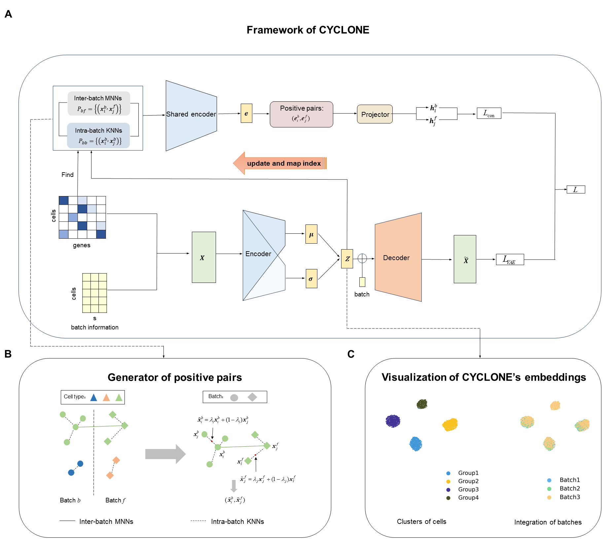

# CYCLONE: recycle contrastive learning for integrating single-cell  gene expression data

## Overview



CYCLONE first inputs the preprocessed data with batch information into a VAE network, where the encoder encodes the preprocessed scRNA-seq expression matrix with batch annotations into a hidden-layer representation after removing the batch effect, which then goes to the decoder along with the batch information to do the reconstruction in order to preserve the spatial structure of the original data, yielding a reconstruction loss. While training the VAE network, inter-batch MNN pairs and intra-batch KNN pairs are found in the embedding $Z$ every 10 epochs. The purpose of the recycle operation is to enhance the confidence of the positive sample pairs, while the MNN pairs are augmented with the inter-batch KNN pairs to extend the coverage of the shared cell types. CYCLONE uses the augmented MNN pairs as the new positive sample pairs, and the negative sample pairs are randomly sampled from the entire dataset. The constructed sample pairs are input to the shared encoder for dimensionality reduction, and later further projected through the projector to make the information more focused on the task of contrast learning, and then the contrast learning loss is used to distance the positive sample pairs in and the negative sample pairs out to acquire the contrast learning loss. The reconstruction loss and the contrastive loss together guide the removal of the batch effect through a weighted combination.

## Quick start

Load the data to be analyzed:

```python
import scanpy as sc

adata = sc.read_h5ad(data)
```

Perform data pre-processing:

```python
def data_preprocess(adata, batch_key, label_key, select_hvg=None, scale=False):
    '''
      return:
         adata: AnnData object of scanpy package. Embedding and clustering result will be          stored in adata.obsm['cyclone_emb'] and adata.obs['cyclone_cluster']
    '''
    # =========== 
    # example
    adata.obs['Batch'] = adata.obs[batch_key]
    adata.obs['celltype'] = adata.obs[label_key]

    sc.pp.filter_genes(adata, min_cells=1)
    sc.pp.normalize_total(adata, target_sum=1e4)
    sc.pp.log1p(adata)

    if select_hvg is not None:
        sc.pp.highly_variable_genes(adata, n_top_genes=min(adata.shape[1], select_hvg),
                                    batch_key='Batch')

        adata = adata[:, adata.var.highly_variable].copy()

    if scale:
        warnings.warn('Scaling per batch! This may cause memory overflow!')
        ada_batches = []
        for bi in adata.obs['Batch'].unique():
            bidx = adata.obs['Batch'] == bi
            adata_batch = adata[bidx].copy()
            sc.pp.scale(adata_batch)

            ada_batches.append(adata_batch)

        adata = sc.concat(ada_batches)


    return adata
adata = data_preprocess(adata)
```

Run the CYCLONE method:

```python
from cyclone.train import cyclone
adata, nmi, ari, k, run_time, BASW, BER, mnn_index = cyclone(adata,
                                                        batch_size=256,
                                                        vae_z_dim=32,
                                                        h_dim=16,
                                                        encode_layers=[1024, 512, 256],
                                                        decode_layers=[256, 512, 1024],
                                                        lr_vae=0.0002,
                                                        train_epoch=30)
```

The output adata contains cluster labels in `adata.obs['cyclone_cluster']` and the cell embeddings in `adata.obsm['cyclone_emb']`. The embeddings can be used as input of other downstream analyses.

<ins>Please refer to `tutorial_cyclone.ipynb` for a detailed description of CYCLONE's usage.<ins>
